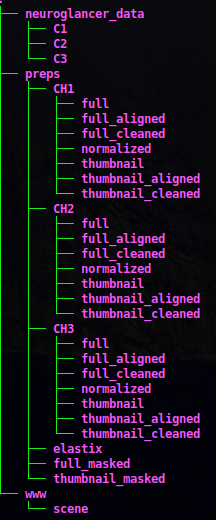

### Table of contents for the pipeline process
1. [Active Brain Atlas home page](https://github.com/ActiveBrainAtlas2)
1. [Installing the pipeline software](SETUP.md)
1. [A description of the pipeline process with detailed instructions](PROCESS.md)
1. [The entire MySQL database schema for the pipeline and the Django portal](schema.sql)
1. [Software design and organization](Design.md)

# Utilities for the Active Atlas Pipeline
## Creating a sandbox on your computer. Only do this on your home computer. Our workstations already have the software installed.
1. git clone this repository, create a virtual environment in your home dir and install the required packages
    ```bash
    git clone git@github.com:ActiveBrainAtlas2/pipeline.git
    sudo python3 -m venv /usr/local/share/pipeline
    cd pipeline_utility
    source /usr/local/share/pipeline/bin/activate
    pip install -r prerequirements.txt
    pip install -r requirements.txt
    ```
1. We are currently using Ubuntu 18.04 as of October 2020. Either install this on your local machine or install it
as a VM with Virtualbox or VMware. Note, using Ubuntu 20.04 also works, and since our servers will eventually 
get upgraded to that, you may as well install 20.04 
1. Create this directory to start with: `sudo mkdir -p /net/birdstore/Active_Atlas_Data/data_root/pipeline_data/DK52/preps/CH1` 
1. Make yourself user: `sudo chown -R $(id -u):$(id -g) /net`
1. Get some thumbnails to start with 
`rsync -auv ratto.dk.ucsd.edu:/net/birdstore/Active_Atlas_Data/data_root/pipeline_data/DK52/preps/CH1/thumbnails/ 
/net/birdstore/Active_Atlas_Data/data_root/pipeline_data/DK52/preps/CH1/thumbnails/`
1. You can now experiment with some of the thumbnails for DK52
### Setup the database portal on your local machine
1. Clone the repository, use the same virtualenv as above. You might need to install some more packages.
    ```bash
    git clone git@github.com:eddyod/ActiveBrainAtlasAdmin.git
    source /usr/local/share/pipeline/bin/activate
    ```
### Mysql for the database portal on Ubuntu
- For complete instructions, look at this page: https://www.digitalocean.com/community/tutorials/how-to-install-mariadb-on-ubuntu-20-04
Step-by-step guide:
1. Install and run mysql
    ```bash
    sudo apt update
    sudo apt install mariadb-server
    sudo mysql_secure_installation
    sudo mysql -u root -p
    ```
1. Create a new user and a new database:
    ```SQL
    CREATE USER 'dklab'@'localhost' IDENTIFIED BY '<your_password_here>';
    GRANT ALL ON active_atlas_development.* TO 'dklab'@'localhost';
    
    CREATE DATABASE active_atlas_development;
    ```
1. Disconnect the database.
1. Setup the database user by creating a file: `~/.my.cnf` in your home directory on your local machine:
    ```
    [client]
    user                        = dklab
    password                    = <your_password_here>
    port                        = 3306
    host                        = localhost
    ```
1. Fetch the database with the last backup from ratto (to current directory), and import it to the database:
    ```bash
    last_backup=`ssh ratto ls -1tr /net/birdstore/Active_Atlas_Data/data_root/database/backups/ | tail -1`
    rsync -auv ratto:/net/birdstore/Active_Atlas_Data/data_root/database/backups/$last_backup ./
    gunzip < $last_backup | sed 's/\DEFINER\=`[^`]*`@`[^`]*`//g' | mysql active_atlas_development
    ```
1. Test by going into the database and running some commands:
    ```bash
    mysql active_atlas_development
    ```
    In SQL prompt:
    ```SQL
    show tables;
    ```

### Tools we use
1. Here is a list of the software we use on a daily basis
1. Visual Code - IDE for python and typescript. This is free and works on most OSs.
1. Dbeaver - database GUI tool
1. imagemagick - used for converting images.
1. matlab - we are just starting to use this. UCSD license is also available
1. jupyter notebooks
1. Fiji, port of ImageJ
1. 3D Slicer 
1. Gimp - image editing software
1. Geeqie - image viewer


### Directory structure of the pipeline
1. The base directory is located on birdstore at: `/net/birdstore/Active_Atlas_Data/data_root/pipeline_data`
2. All brains are located in the base directory.
3. To view the post tif pipeline process go here: [Neuroglancer process](PROCESS.md)
4. The directory structure of a 3 channel brain will look like this:


### Annotations
1. Annotation keys are viewable in the database: https://activebrainatlas.ucsd.edu/activebrainatlas/admin/neuroglancer/structure/

### Database backups
1. The development and production databases are backed up multiple times each day on basalis
1. If you need a backup, look on basalis at: `/net/birdstore/Active_Atlas_Data/data_root/database/backups/`
1. The development database is named `active_atlas_development`
1. The production database is named `active_atlas_production`
### Setting up SSH connections to the servers
1. Refer [Checking for existing SSH keys](https://docs.github.com/en/free-pro-team@latest/github/authenticating-to-github/checking-for-existing-ssh-keys) and [Generating a new SSH key and adding it to the ssh-agent](https://docs.github.com/en/enterprise-server@2.19/github/authenticating-to-github/generating-a-new-ssh-key-and-adding-it-to-the-ssh-agent) for setting up the SSH on your local machine.
1. Substitute hostX and domainname names below with real names
1. Appending the following test in the SSH config file `~/.ssh/config` to allow SSH server name aliasing
```
Host host1
  HostName host1.domainname
  User <AD_username_here>

Host host2
  HostName host2.domainname
  User <AD_username_here>

Host host3
  HostName host3.domainname
  User <AD_username_here>
```

Then copy the SSH identity to the remote server, enter your AD password when prompted.
```bash
for server in host1, host2 host3; do
    ssh-copy-id -i $server
done
```

Now you should be able to SSH into the servers without password.

### Set up PYTHONPATH environmental variable

the pythonpath environmental variable allows you to add folder to the search path of python automatically.  This is useful for adding project folder to python path so that they work like normal packages in terms of imports.

to do this, edit the activate file in virtual environment and the following lines to the end:

```
unset PYTHONPATH
export PYTHONPATH=~/first_location:${PYTHONPATH}
export PYTHONPATH=~/second_location:${PYTHONPATH}
...
```

### Set up virtual environment

1. install list of packages in requirements.txt
2. install elastics

